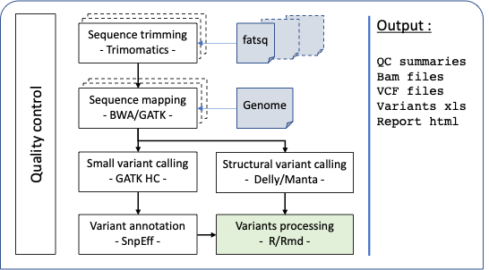

```{r setup, include=FALSE}
knitr::opts_chunk$set(echo=FALSE , warning=FALSE, error=FALSE, message=FALSE, out.width="70%", fig.show="hold")
```


```{r}
# title: "`r params$title`"
# workspace<-params$result_dir
# sample_sheet.file <- params$sample_sheet
# DP.min <- params$DP.min
# AR.min <- params$AR.min
# qual.min <- params$qual.min

# Genome.file <- "/save/project/ijpb/bank/GENOME/Ppatens-patens-v3.3-WG/Ppatens-patens-v3.3-WG.fa"
Genome.file <- "Physcomitrium_patens_V4_genome.fasta"

projectName <- "PE-WGS_v4"

workspace <- "/Users/nbentahar/Desktop/msgenova_test/PE_WGS_v4/results"
#workspace <- "/Users/nbentahar/Documents/PROJECTs/DEV/msgenova/examples/soj/results/"

sample_sheet.file <- "/Users/nbentahar/Desktop/msgenova_test/PE_WGS_v4/sample_sheet_PE.txt"
#sample_sheet.file <- "/Users/nbentahar/Documents/PROJECTs/DEV/msgenova/examples/soj/sample_sheet_soj_3samples.txt"

DP.min <- 4
AR.min <- 0.8
qual.min <- 30
nbr.alt.min <- 3
```

```{r}
#libraries
library(DT)
library(ggplot2)
library(vcfR)
library(dplyr)
library(tidyr)
library(yaml)
library(stringr)
library(ComplexHeatmap)
library(dendextend) 
library(GenomicRanges)
library(gplots)
source("functions.R")
```

# Input data
## Genome version
```{r}
print(basename(Genome.file))
```


## Samples
```{r}
# error message if sample sheet not exist
if(!file.exists(sample_sheet.file)) stop("Error: ")

# read sample sheet
sample_sheet <- read.csv(file = sample_sheet.file, header = TRUE, sep = "\t")
```

```{r}
sampleNames <- unique(sample_sheet$sample)
```

```
List of samples : `r sampleNames`
```

```{r list samples}

dplyr::select(sample_sheet, sample, condition) %>% unique() %>% 
  dplyr::group_by(condition) %>% dplyr::count(name = "nb_samples") %>% 
  DT::datatable(rownames = FALSE, options = list(rownames = TRUE, pageLength = 6, scrollX = T, dom = 'tip'),
                class = 'cell-border stripe', caption = "List of conditions")

```

# MsGenoVa workflow



# Sequence trimming step

Sequences were trimmed with Trimmomatic tools...

```{r trimming stat}
trim.file <- paste0(workspace,"/01_sequence_qc/log/trimmomatic.log")
if(!file.exists(trim.file)) stop("Error: ")

read.table(text = gsub(" ","\t",readLines(trim.file)),  header=TRUE) %>%
  DT::datatable(rownames = FALSE, caption = "Read cleaning results",
                options = list(rownames = TRUE, pageLength = 6, scrollX = T, dom = 'tip'),
                class = 'cell-border stripe')

```

# Mapping step

Sequences were aligned using BWA MEM (v?) ...

```{r mapping step}
map.file <- paste0(workspace,"/02_mapping/flagstat/concatenate_flagstat.txt")
if(!file.exists(map.file)) stop("Error: ")
```


## Mapping rate

```{r mapping rate}
flagstat.file <- paste0(workspace,"/02_mapping/flagstat/concatenate_flagstat.txt")
if(file.exists(flagstat.file)){
    flagstat <- read.table(flagstat.file, sep="\t", header=FALSE) %>%
      dplyr::mutate(mapped.reads=V3-V4, mapped.read.ratio=round(mapped.reads/(V2)*100,2)) %>% dplyr::select(-V3, -V4)
    names(flagstat) <- c("sample", "raw.reads", "mapped.reads", "mapped.read.ratio")

  }


#count
nbr.reads.melt <- flagstat %>% dplyr::mutate(xlabel=paste0(sample, "(", mapped.read.ratio, "%)"), unmapped.reads=raw.reads-mapped.reads) %>% 
  dplyr::select(mapped.reads, unmapped.reads, xlabel) %>%
  reshape2::melt(id = "xlabel", value.name = "nbr.reads")

```


```{r mapping rate plot}
p <- ggplot(data = nbr.reads.melt) + geom_col(aes(y=xlabel, x=nbr.reads, fill=variable)) + 
  labs(x="nb of reads", y="samples (mapping rate %)", fill="")

print(p)
```


```{r mapping rate summary}
DT::datatable(flagstat, options = list(rownames = TRUE, pageLength = 6, scrollX = T, dom = 'tip'),
              class = 'cell-border stripe', rownames = FALSE, caption = "")
```


## Mapping coverage

```{r mapping coverage}
cov.list <- lapply(sample_sheet$sample, function(x){
  file <- paste0(workspace,"/02_mapping/coverage/", x, ".coverage")
  if(file.exists(file)){

    read.table(file, sep="\t") %>%  dplyr::filter(V4 > 1)  %>% dplyr::mutate(sample = x)
  }
})

cov <- purrr::reduce(cov.list, rbind)
colnames(cov) <- c("rname",	"startpos",	"endpos",	"numreads",	"covbases",	"coverage(%)",	"meandepth(X)",	"meanbaseq",	"meanmapq", "sample")
cov$coverage <- round(cov$coverage, 2)

cov <- cov %>% mutate(xlabel=paste0(rname, "(", endpos-startpos, ")")) %>% 
  dplyr::filter(!stringr::str_detect(stringr::str_to_lower(rname), pattern = "scaffold")) %>%
  dplyr::filter(!stringr::str_detect(stringr::str_to_lower(rname), pattern = "chloroplast")) %>%
  dplyr::filter(!stringr::str_detect(stringr::str_to_lower(rname), pattern = "mitochondria"))
```


```{r mapping coverage plot}
p <- select(cov, rname, `meandepth(X)`, `coverage(%)`, sample, xlabel) %>% reshape2::melt(id = c("rname", "sample", "xlabel")) %>% 
  ggplot() + geom_boxplot(aes(x=value, y=xlabel)) + 
  xlab("") + ylab("chromosome names (size bp)") + 
  facet_grid(~variable, scales = "free")

print(p)
```
```{r mapping coverage summary}
cov %>% dplyr::select(sample, rname, `meandepth(X)`, `coverage(%)`) %>% 
  DT::datatable(rownames = FALSE, caption = "",
                options = list(rownames = TRUE, pageLength = 6, scrollX = T, dom = 'tip'),
                class = 'cell-border stripe')
```


# Small variant calling step (GATK)
```{r}
vcf.file <- paste0(workspace,"/03_snv_indels_calling/", projectName , "_snv_indel.vcf")
if(!file.exists(vcf.file)) stop("Error: ")
```


```{r}

vcfR <- vcfR::read.vcfR(vcf.file, verbose = FALSE)

vcfR.tb.list <- vcfR::vcfR2tidy(vcfR, verbose = FALSE, info_fields = c("AC","MQ", "ANN"), 
                                                     format_fields = c("Indiv", "AD", "DP"))

vcfR.tb <- dplyr::full_join(vcfR.tb.list$fix, vcfR.tb.list$gt, by = c("ChromKey", "POS"))
rm(vcfR.tb.list)

# split multiallelic variants + add columns  with var type information
variants.gatk <- vcfR_split_multiAlt(vcfR.tb, nbrAlt = 2) 

variants.gatk <- variants.gatk %>%
  tidyr::separate(gt_AD, c("gt_ref_AD", "gt_alt_AD"), sep = ",") %>%
  dplyr::mutate(gt_AR = dplyr::if_else(gt_DP == 0 | is.na(gt_DP), NA, as.numeric(gt_alt_AD)/gt_DP),
                var_length = str_length(ALT) - str_length(REF) + 1,
                var_type   = dplyr::if_else(var_length == 1, "SNV", 
                             dplyr::if_else(var_length  < 1, "DEL", "INS")),
                ID = paste(CHROM, POS, REF, ALT, sep = "_"), tools = "GATK")

variants.gatk <- variant.freq(variants.gatk)

```

## Variant calling quality control

### Score quality

```{r out.width="60%", fig.show="hold"}
# Score de qualité
p <- variants.gatk %>% select(ID, QUAL) %>% unique() %>% ggplot() + geom_density(aes(QUAL)) + xlim(0,200) +
  xlab("quality score") + geom_vline(xintercept = qual.min, color = "red") + ggtitle("Variant quality score distribution")
print(p)

```

### Variant coverage

```{r out.width="50%", fig.show="hold"}
vcf.tbl.g   <- dplyr::filter(variants.gatk,   gt_AR != 0, !is.na(gt_AR))

# distribution de la couverture des positions variantes
p <- ggplot(data=vcf.tbl.g) + geom_density(aes(x=gt_DP, color=Indiv)) + xlim(0,50) +
  ylab("DP of variants") + geom_vline(xintercept = DP.min, color = "red") + ggtitle("Variant depth of coverage distribution")
if (length(unique(vcf.tbl.g$Indiv)) > 15){
  p <- p + theme(legend.position="none")
}

print(p)

# Distribution de l'allèle ratio
p <- ggplot(data=vcf.tbl.g) + geom_density(aes(gt_AR, color=Indiv)) + 
  xlab("Alternative allele ratio") + xlim(0,1) + geom_vline(xintercept = AR.min, color = "red")+ ggtitle("Variant allele ratio distribution")

if (length(unique(vcf.tbl.g$Indiv)) > 15){
  p <- p + theme(legend.position="none")
}

print(p)

```

```{r out.width="60%", fig.show="hold"}
NA_ID <- filter(variants.gatk, nb_NA > 0)$ID

variants.gatk %>% filter(ID %in% NA_ID) %>% 
  ggplot() +  geom_bar(aes(x=as.factor(nb_NA))) + 
  theme(axis.text.x = element_text(angle = 90, size = rel(0.8), hjust = 0)) + xlab("nb of samples") + 
  ylab("Non covered positions") + ggtitle("Non covered variant positions")


```


### Low quality variant filtering

* score de qualité : > `r qual.min`
* nombre de reads qui couvrent la position variant : > `r DP.min`
* nombre de reads qui portent l'allèle alternatif : > 1
* min AR : `r AR.min`
* retirer les positions avec au moins un échantillon non couvert.

```{r}
# remove 
variants.gatk.flt <- variants.gatk %>% 
  dplyr::mutate(gt_alt_AD = dplyr::if_else(as.numeric(gt_alt_AD) < 2, 0, as.numeric(gt_alt_AD)),
                gt_AR     = dplyr::if_else(gt_DP == 0 | is.na(gt_DP), NA, as.numeric(gt_alt_AD)/gt_DP)) %>% 
  dplyr::filter(!is.na(gt_DP), gt_DP >= DP.min, QUAL >= qual.min, nb_NA == 0, freq_ho == freq)

```

## Descriptive stat of variants

### variant count per sample

```{r }

vcf.tbl.q.g <- filter(variants.gatk.flt, gt_AR != 0, !is.na(gt_AR))


vcf.tbl.q.g %>% 
  dplyr::mutate(tag=if_else(freq == length(unique(sample_sheet$sample)), "common", "noCommon")) %>% 
  dplyr::select(ID, Indiv, var_type, tag) %>%
  dplyr::mutate(Indiv=if_else(tag == "common", "common", Indiv)) %>% unique() %>%
  ggplot() + geom_bar(aes(x=Indiv, fill=var_type)) + 
  theme(axis.text.x = element_text(angle = 90, vjust = 0.5, hjust=1)) + 
  xlab("") + ylab("nb of variants")

```
* common : les variants communs à tous les échantillons.

### Variant frequency in samples

```{r }

p <- vcf.tbl.q.g %>% dplyr::select(Indiv, freq, ID) %>% group_by(Indiv, freq) %>% 
  dplyr::count(name = "nb_var")  %>% filter(freq != length(unique(sample_sheet$sample))) %>% 
  ggplot(aes(x=as.factor(freq), y=nb_var)) + geom_boxplot(outlier.shape = NA) +
  geom_point(size = 0.8, aes(color=Indiv), position=position_jitter(width = 0.2)) + xlab("freq in samples") + ylab("# variants")

if (length(unique(vcf.tbl.q.g$Indiv)) > 15){
  
  p <- p + theme(legend.position="none")
}
print(p)

# warning -> samples with the same variants or pas de variant
```

## Specific variants

```{r}
vcf.tbl.q.g.condition <- vcf.tbl.q.g %>% 
  dplyr::full_join(dplyr::select(sample_sheet, sample, condition), by = c("Indiv" = "sample")) %>% 
  tidyr::separate(ANN, c("tmp1", "effect", "tmp2", "gene"), sep = "[|]", extra = "drop") %>% dplyr::select(-tmp1, -tmp2)


tb <- vcf.tbl.q.g.condition %>%  
  dplyr::select(ID, condition) %>% 
  dplyr::group_by(ID, condition) %>% unique() %>% 
  reshape2::dcast(ID~condition, value.var = "condition") %>%
  dplyr::mutate_at(.vars = names(.)[-1], .funs = function(x){if_else(is.na(x), 0, 1)})

venn::venn(tb[,-1])
```

On va s'interesser aux :

* variants specifiques à chaques groupes.
* variants communs uniquement entre les groups **PE** et **SPE**.

```{r}

# je retirer les variations communs

freq_condition <- lapply(unique(vcf.tbl.q.g.condition$condition), function(x){
  
  vcf.tbl.q.g.condition %>% filter(condition == x) %>% group_by(ID) %>% dplyr::count(name = paste0("freq_", x)) %>% return()
}) %>% purrr::reduce(full_join, by = "ID") %>% dplyr::mutate_at(.vars = names(.)[-1], .funs = function(x){if_else(is.na(x), 0, x)})

vcf.tbl.q.g <- vcf.tbl.q.g.condition %>% full_join(freq_condition, by = "ID")

```

### in WT group

```{r, out.width="70%", fig.show="hold"}

gatk_var_WT  <- filter(vcf.tbl.q.g, freq_WT  == freq) %>% 
  dplyr::select(-freq_WT, -freq_Pro, -freq_T, -freq_PE, -freq_SPE, -ChromKey, -freq_ho)

gatk_var_WT %>% select(ID, gt_AR, Indiv) %>% 
  reshape2::dcast(ID~Indiv, value.var = "gt_AR") %>%
  mutate_at(.vars = names(.)[-1], .funs = function(x){if_else(is.na(x), 0, 1)}) %>% 
  dplyr::select(-ID) %>% venn::venn()

gatk_var_WT %>% dplyr::select(-ID, -FILTER, -AC, -MQ, -gt_ref_AD, -gt_GT_alleles, -nb_0, -nb_NA) %>%
  DT::datatable(rownames = FALSE, options = list(rownames = TRUE, pageLength = 6, scrollX = T, dom = 'tip'), 
                class = 'cell-border stripe', caption = "")

names(gatk_var_WT)
```

### in Pro group

```{r, out.width="70%", fig.show="hold"}
# 
gatk_var_Pro <- filter(vcf.tbl.q.g, freq_Pro == freq) %>% 
  dplyr::select(-freq_WT, -freq_Pro, -freq_T, -freq_PE, -freq_SPE, -ChromKey, -freq_ho)

gatk_var_Pro %>% select(ID, gt_AR, Indiv) %>% 
  reshape2::dcast(ID~Indiv, value.var = "gt_AR") %>%
  mutate_at(.vars = names(.)[-1], .funs = function(x){if_else(is.na(x), 0, 1)}) %>% 
  dplyr::select(-ID) %>% venn::venn()

gatk_var_Pro %>% dplyr::select(-ID, -FILTER, -AC, -MQ, -gt_ref_AD, -gt_GT_alleles, -nb_0, -nb_NA) %>%
  DT::datatable(rownames = FALSE, options = list(rownames = TRUE, pageLength = 6, scrollX = T, dom = 'tip'), 
                class = 'cell-border stripe', caption = "")
```

### in T group

```{r, out.width="70%", fig.show="hold"}
gatk_var_T   <- filter(vcf.tbl.q.g, freq_T   == freq) %>% 
  dplyr::select(-freq_WT, -freq_Pro, -freq_T, -freq_PE, -freq_SPE, -ChromKey, -freq_ho)

gatk_var_T %>% select(ID, gt_AR, Indiv) %>% 
  reshape2::dcast(ID~Indiv, value.var = "gt_AR") %>%
  mutate_at(.vars = names(.)[-1], .funs = function(x){if_else(is.na(x), 0, 1)}) %>% 
  dplyr::select(-ID) %>% venn::venn()

gatk_var_T %>% dplyr::select(-ID, -FILTER, -AC, -MQ, -gt_ref_AD, -gt_GT_alleles, -nb_0, -nb_NA) %>%
  DT::datatable(rownames = FALSE, options = list(rownames = TRUE, pageLength = 6, scrollX = T, dom = 'tip'), 
                class = 'cell-border stripe', caption = "")
```

### in PE group

```{r, out.width="70%", fig.show="hold"}
gatk_var_PE  <- filter(vcf.tbl.q.g, freq_PE  == freq) %>% 
  dplyr::select(-freq_WT, -freq_Pro, -freq_T, -freq_PE, -freq_SPE, -ChromKey, -freq_ho)

gatk_var_PE %>% select(ID, gt_AR, Indiv) %>% 
  reshape2::dcast(ID~Indiv, value.var = "gt_AR") %>%
  mutate_at(.vars = names(.)[-1], .funs = function(x){if_else(is.na(x), 0, 1)}) %>% 
  dplyr::select(-ID) %>% venn::venn()

gatk_var_PE %>% dplyr::select(-ID, -FILTER, -AC, -MQ, -gt_ref_AD, -gt_GT_alleles, -nb_0, -nb_NA) %>%
  DT::datatable(rownames = FALSE, options = list(rownames = TRUE, pageLength = 6, scrollX = T, dom = 'tip'), 
                class = 'cell-border stripe', caption = "")
```

### in SPE group

```{r, out.width="70%", fig.show="hold"}
gatk_var_SPE <- filter(vcf.tbl.q.g, freq_SPE == freq) %>% 
  dplyr::select(-freq_WT, -freq_Pro, -freq_T, -freq_PE, -freq_SPE, -ChromKey, -freq_ho)

gatk_var_SPE %>% select(ID, gt_AR, Indiv) %>% 
  reshape2::dcast(ID~Indiv, value.var = "gt_AR") %>%
  mutate_at(.vars = names(.)[-1], .funs = function(x){if_else(is.na(x), 0, 1)}) %>% 
  dplyr::select(-ID) %>% venn::venn()

gatk_var_SPE %>% dplyr::select(-ID, -FILTER, -AC, -MQ, -gt_ref_AD, -gt_GT_alleles, -nb_0, -nb_NA) %>%
  DT::datatable(rownames = FALSE, options = list(rownames = TRUE, pageLength = 6, scrollX = T, dom = 'tip'), 
                class = 'cell-border stripe', caption = "")
```

### in PE, SPE groups

```{r, out.width="70%", fig.show="hold"}

gatk_var_PE_SPE <- filter(vcf.tbl.q.g, freq_SPE + freq_PE == freq) %>% 
  dplyr::select(-freq_WT, -freq_Pro, -freq_T, -freq_PE, -freq_SPE, -ChromKey, -freq_ho)

gatk_var_PE_SPE %>% select(ID, gt_AR, Indiv) %>% 
  reshape2::dcast(ID~Indiv, value.var = "gt_AR") %>%
  mutate_at(.vars = names(.)[-1], .funs = function(x){if_else(is.na(x), 0, 1)}) %>% 
  dplyr::select(-ID) %>% venn::venn()

gatk_var_PE_SPE %>% dplyr::select(-ID, -FILTER, -AC, -MQ, -gt_ref_AD, -gt_GT_alleles, -nb_0, -nb_NA) %>%
  DT::datatable(rownames = FALSE, options = list(rownames = TRUE, pageLength = 6, scrollX = T, dom = 'tip'), 
                class = 'cell-border stripe', caption = "")
```


# Small variant calling step (Varscan)

```{r}

snv_varscan.vcfR.tb <- lapply(sample_sheet$sample, function(x){
  file <- paste0(workspace,"/03_bis_small_indel_varscan/", x, ".vcf.gz")
  if(file.exists(file)){

    vcfR <- vcfR::read.vcfR(file, verbose = FALSE)
    vcfR.tb.list <- vcfR::vcfR2tidy(vcfR, verbose = FALSE, info_fields = c("AC","MQ", "ANN"), 
                                                         format_fields = c("Indiv", "DP", "RD", "AD"))

    vcfR.tb <- dplyr::full_join(vcfR.tb.list$fix, vcfR.tb.list$gt, by = c("ChromKey", "POS"))
    
    return(vcfR.tb)
  }
}) %>% purrr::reduce(rbind)


# filter(snv_varscan.vcfR.tb, CHROM == "Chr08", Indiv == "PE-1") #, str_detect(POS,"10812105"))

```


```{r}

variants.varscan <- snv_varscan.vcfR.tb %>%
  dplyr::mutate(gt_AR = dplyr::if_else(gt_DP == 0 | is.na(gt_DP), NA, gt_AD/gt_DP),
                var_length = str_length(ALT) - str_length(REF) + 1,
                var_type   = dplyr::if_else(var_length == 1, "SNV", 
                             dplyr::if_else(var_length  < 1, "DEL", "INS")),
                ID = paste(CHROM, POS, REF, ALT, sep = "_"), tools = "Varscan")

variants.varscan <- variant.freq(variants.varscan)

```

## Variant calling quality control

### Variant coverage

```{r out.width="50%", fig.show="hold"}
vcf.tbl.g   <- dplyr::filter(variants.varscan,   gt_AR != 0, !is.na(gt_AR))

# distribution de la couverture des positions variantes
p <- ggplot(data=vcf.tbl.g) + geom_density(aes(x=gt_DP, color=Indiv)) + xlim(0,50) +
  ylab("DP of variants") + geom_vline(xintercept = DP.min, color = "red") + ggtitle("Variant depth of coverage distribution")
if (length(unique(vcf.tbl.g$Indiv)) > 15){
  p <- p + theme(legend.position="none")
}

print(p)

# Distribution de l'allèle ratio
p <- ggplot(data=vcf.tbl.g) + geom_density(aes(gt_AR, color=Indiv)) + 
  xlab("Alternative allele ratio") + xlim(0,1) + geom_vline(xintercept = AR.min, color = "red")+ ggtitle("Variant allele ratio distribution")

if (length(unique(vcf.tbl.g$Indiv)) > 15){
  p <- p + theme(legend.position="none")
}

print(p)
```

### Low quality variant filtering

* nombre de reads qui couvrent la position variant : > `r DP.min`
* nombre de reads qui portent l'allèle alternatif : > 1
* min AR : `r AR.min`

```{r}
# remove 
variants.varscan.flt <- variants.varscan %>% 
  dplyr::mutate(gt_AD = dplyr::if_else(gt_AD < 2, 0, as.numeric(gt_AD)),
                gt_AR = dplyr::if_else(gt_DP == 0 | is.na(gt_DP), NA, gt_AD/gt_DP)) %>% 
  dplyr::filter(!is.na(gt_DP), gt_DP >= DP.min, FILTER == "PASS", freq_ho == freq)

```

## Descriptive stat of variants

### variant count per sample

```{r }

vcf.tbl.q.g <- filter(variants.varscan.flt, gt_AR != 0, !is.na(gt_AR))


vcf.tbl.q.g %>% 
  dplyr::mutate(tag=if_else(freq == length(unique(sample_sheet$sample)), "common", "noCommon")) %>% 
  dplyr::select(ID, Indiv, var_type, tag) %>%
  dplyr::mutate(Indiv=if_else(tag == "common", "common", Indiv)) %>% unique() %>%
  ggplot() + geom_bar(aes(x=Indiv, fill=var_type)) + 
  theme(axis.text.x = element_text(angle = 90, vjust = 0.5, hjust=1)) + 
  xlab("") + ylab("nb of variants")

```

### Variant frequency in samples

```{r }

p <- vcf.tbl.q.g %>% dplyr::select(Indiv, freq, ID) %>% group_by(Indiv, freq) %>% 
  dplyr::count(name = "nb_var")  %>% filter(freq != length(unique(sample_sheet$sample))) %>% 
  ggplot(aes(x=as.factor(freq), y=nb_var)) + geom_boxplot(outlier.shape = NA) +
  geom_point(size = 0.8, aes(color=Indiv), position=position_jitter(width = 0.2)) + xlab("freq in samples") + ylab("# variants")

if (length(unique(vcf.tbl.q.g$Indiv)) > 15){
  
  p <- p + theme(legend.position="none")
}
print(p)

# warning -> samples with the same variants or pas de variant
```


## Specific variants

```{r}
vcf.tbl.q.g.condition <- dplyr::full_join(vcf.tbl.q.g, dplyr::select(sample_sheet, sample, condition), by = c("Indiv" = "sample"))


tb <- vcf.tbl.q.g.condition %>%  
  dplyr::select(ID, condition) %>% 
  dplyr::group_by(ID, condition) %>% unique() %>% 
  reshape2::dcast(ID~condition, value.var = "condition") %>%
  dplyr::mutate_at(.vars = names(.)[-1], .funs = function(x){if_else(is.na(x), 0, 1)})

venn::venn(tb[,-1])
```

On va s'interesser aux :

* variants specifiques à chaques groupes.
* variants communs uniquement entre les groups **PE** et **SPE**.

```{r}

freq_condition <- lapply(unique(vcf.tbl.q.g.condition$condition), function(x){
  
  vcf.tbl.q.g.condition %>% filter(condition == x) %>% group_by(ID) %>% dplyr::count(name = paste0("freq_", x)) %>% return()
}) %>% purrr::reduce(full_join, by = "ID") %>% dplyr::mutate_at(.vars = names(.)[-1], .funs = function(x){if_else(is.na(x), 0, x)})

vcf.tbl.q.g <- vcf.tbl.q.g.condition %>% full_join(freq_condition, by = "ID")

```

### in WT group

```{r, out.width="70%", fig.show="hold"}
# 
varscan_var_WT  <- filter(vcf.tbl.q.g, freq_WT  == freq) %>% 
  dplyr::select(-freq_WT, -freq_Pro, -freq_T, -freq_PE, -freq_SPE, -ChromKey, -freq_ho)

varscan_var_WT %>% select(ID, gt_AR, Indiv) %>% 
  reshape2::dcast(ID~Indiv, value.var = "gt_AR") %>%
  mutate_at(.vars = names(.)[-1], .funs = function(x){if_else(is.na(x), 0, 1)}) %>% 
  dplyr::select(-ID) %>% venn::venn()

varscan_var_WT %>% dplyr::select(-ID, -FILTER, -AC, -MQ, -gt_RD, -gt_GT_alleles, -nb_0, -nb_NA) %>%
  DT::datatable(rownames = FALSE, options = list(rownames = TRUE, pageLength = 6, scrollX = T, dom = 'tip'), 
                class = 'cell-border stripe', caption = "")
```

### in Pro group

```{r, out.width="70%", fig.show="hold"}
# 
varscan_var_Pro <- filter(vcf.tbl.q.g, freq_Pro == freq) %>% 
  dplyr::select(-freq_WT, -freq_Pro, -freq_T, -freq_PE, -freq_SPE, -ChromKey, -freq_ho)

varscan_var_Pro %>% select(ID, gt_AR, Indiv) %>% 
  reshape2::dcast(ID~Indiv, value.var = "gt_AR") %>%
  mutate_at(.vars = names(.)[-1], .funs = function(x){if_else(is.na(x), 0, 1)}) %>% 
  dplyr::select(-ID) %>% venn::venn()

varscan_var_Pro %>% dplyr::select(-ID, -FILTER, -AC, -MQ, -gt_RD, -gt_GT_alleles, -nb_0, -nb_NA) %>%
  DT::datatable(rownames = FALSE, options = list(rownames = TRUE, pageLength = 6, scrollX = T, dom = 'tip'), 
                class = 'cell-border stripe', caption = "")
```

### in T group

```{r, out.width="70%", fig.show="hold"}
varscan_var_T   <- filter(vcf.tbl.q.g, freq_T   == freq) %>% 
  dplyr::select(-freq_WT, -freq_Pro, -freq_T, -freq_PE, -freq_SPE, -ChromKey, -freq_ho)

varscan_var_T %>% select(ID, gt_AR, Indiv) %>% 
  reshape2::dcast(ID~Indiv, value.var = "gt_AR") %>%
  mutate_at(.vars = names(.)[-1], .funs = function(x){if_else(is.na(x), 0, 1)}) %>% 
  dplyr::select(-ID) %>% venn::venn()

varscan_var_T %>% dplyr::select(-ID, -FILTER, -AC, -MQ, -gt_RD, -gt_GT_alleles, -nb_0, -nb_NA) %>%
  DT::datatable(rownames = FALSE, options = list(rownames = TRUE, pageLength = 6, scrollX = T, dom = 'tip'), 
                class = 'cell-border stripe', caption = "")
```

### in PE group

```{r, out.width="70%", fig.show="hold"}
varscan_var_PE  <- filter(vcf.tbl.q.g, freq_PE  == freq) %>% 
  dplyr::select(-freq_WT, -freq_Pro, -freq_T, -freq_PE, -freq_SPE, -ChromKey, -freq_ho)

varscan_var_PE %>% select(ID, gt_AR, Indiv) %>% 
  reshape2::dcast(ID~Indiv, value.var = "gt_AR") %>%
  mutate_at(.vars = names(.)[-1], .funs = function(x){if_else(is.na(x), 0, 1)}) %>% 
  dplyr::select(-ID) %>% venn::venn()

varscan_var_PE %>% dplyr::select(-ID, -FILTER, -AC, -MQ, -gt_RD, -gt_GT_alleles, -nb_0, -nb_NA) %>%
  DT::datatable(rownames = FALSE, options = list(rownames = TRUE, pageLength = 6, scrollX = T, dom = 'tip'), 
                class = 'cell-border stripe', caption = "")
```

### in SPE group

```{r, out.width="70%", fig.show="hold"}
varscan_var_SPE <- filter(vcf.tbl.q.g, freq_SPE == freq) %>% 
  dplyr::select(-freq_WT, -freq_Pro, -freq_T, -freq_PE, -freq_SPE, -ChromKey, -freq_ho)

varscan_var_SPE %>% select(ID, gt_AR, Indiv) %>% 
  reshape2::dcast(ID~Indiv, value.var = "gt_AR") %>%
  mutate_at(.vars = names(.)[-1], .funs = function(x){if_else(is.na(x), 0, 1)}) %>% 
  dplyr::select(-ID) %>% venn::venn()

varscan_var_SPE %>% dplyr::select(-ID, -FILTER, -AC, -MQ, -gt_RD, -gt_GT_alleles, -nb_0, -nb_NA) %>%
  DT::datatable(rownames = FALSE, options = list(rownames = TRUE, pageLength = 6, scrollX = T, dom = 'tip'), 
                class = 'cell-border stripe', caption = "")
```

### in PE, SPE groups

```{r, out.width="70%", fig.show="hold"}

varscan_var_PE_SPE <- filter(vcf.tbl.q.g, freq_SPE + freq_PE == freq) %>% 
  dplyr::select(-freq_WT, -freq_Pro, -freq_T, -freq_PE, -freq_SPE, -ChromKey, -freq_ho)

varscan_var_PE_SPE %>% select(ID, gt_AR, Indiv) %>% 
  reshape2::dcast(ID~Indiv, value.var = "gt_AR") %>%
  mutate_at(.vars = names(.)[-1], .funs = function(x){if_else(is.na(x), 0, 1)}) %>% 
  dplyr::select(-ID) %>% venn::venn()

varscan_var_PE_SPE %>% dplyr::select(-ID, -FILTER, -AC, -MQ, -gt_RD, -gt_GT_alleles, -nb_0, -nb_NA) %>%
  DT::datatable(rownames = FALSE, options = list(rownames = TRUE, pageLength = 6, scrollX = T, dom = 'tip'), 
                class = 'cell-border stripe', caption = "")
```


## annotations
```{r, eval=FALSE}

colname.ANN <- c("Allele", "effect", "impact", "GeneName", 
                 "GeneID", "FeatureType", "FeatureID", "TranscriptBiotype", 
                 "Rank", "HGVS.c", "HGVS.p", "cDNA_len:", 
                 "CDS_len", "Protein_len", "DistanceToFeature", "Warnings")

exlude_effect <- c("upstream_gene_variant", "downstream_gene_variant", "intergenic_region", "intragenic_variant", "intragenic_variant", 
                   "3_prime_UTR_variant", "", "", "")

ID.ANN <- vcf.tbl.q.g %>% dplyr::select(ID, ANN) %>% unique() 


ANN.split <- lapply(1:dim(ID.ANN)[1], FUN = function(x){
  
  tmp <- ID.ANN$ANN[x] %>% str_split(",") %>% unlist()
  data.frame(ID = rep(ID.ANN$ID[x], length(tmp)), ANN = tmp)
  
}) %>% purrr::reduce(rbind) %>% 
  tidyr::separate(col = ANN, into = colname.ANN, sep = "[|]") %>% 
  dplyr::filter(!effect %in% exlude_effect) %>% 
  dplyr::select(ID, effect) %>% unique()

effect.split <- lapply(1:dim(ANN.split)[1], function(x){
  
  tmp <- ANN.split$effect[x] %>% stringr::str_split("&") %>% unlist()
  data.frame(ID = rep(ANN.split$ID[x], length(tmp)), effect = tmp)
}) %>% purrr::reduce(rbind)


effect.split %>% dplyr::group_by(effect) %>% dplyr::count()

```


# Structural variant calling step (delly)

```{r, eval=FALSE}
sv.vcfR.tb <- lapply(sample_sheet$sample, function(x){
  file <- paste0(workspace,"/04_delly/", x, ".vcf.gz")
  if(file.exists(file)){

    vcfR <- vcfR::read.vcfR(file, verbose = FALSE)
    vcfR.tb.list <- vcfR::vcfR2tidy(vcfR, verbose = FALSE)

    vcfR.tb <- dplyr::full_join(vcfR.tb.list$fix, vcfR.tb.list$gt, by = c("ChromKey", "POS")) %>% 
               dplyr::mutate(SVLEN = dplyr::if_else(SVTYPE %in% c("DUP", "DEL", "INV"), END-POS+1, SVLEN),
                             ID    = paste(CHROM, POS, REF, SVTYPE, sep = "_"))
      

    return(vcfR.tb)
  }
}) %>% purrr::reduce(rbind)


```


* Quality score

```{r, eval=FALSE}

# distribution de la couverture des positions variantes
p <- ggplot(data=sv.vcfR.tb) + geom_density(aes(x=QUAL, color=Indiv)) + xlim(0,50) +
  ylab("DP of variants") + geom_vline(xintercept = DP.min, color = "red") + ggtitle("Variant depth of coverage distribution")
if (length(unique(vcf.tbl.g$Indiv)) > 15){
  p <- p + theme(legend.position="none")
}

print(p)
```

## Filter low quality variants

```{r, eval=FALSE}

tmp <- dplyr::filter(sv.vcfR.tb, FILTER == "PASS") %>% dplyr::select(CHROM, POS, END, Indiv, ID, SVTYPE)


gr.reduce <- lapply(c("DEL", "DUP", "INV"), function(x){
  
  tmp.type <- tmp %>% dplyr::filter(SVTYPE == "DEL")
  gr <- GenomicRanges::GRanges(seqnames=tmp.type$CHROM,
           ranges=IRanges(start=tmp.type$POS,
                          end=tmp.type$END))
  
  reduce(gr, with.revmap=TRUE)
  })
names(gr.reduce) <- c("DEL", "DUP", "INV")

gr.bis <- gr[1]

gr[which(gr$SVTYPE == "DUP"),]

subsetByOverlaps(gr, gr.bis)

gr$SVTYPE

gr[,gr$start == 145049]


filter(sv.vcfR.tb, SVTYPE == "INS") %>% arrange(POS) # 29823461

```


```{r, eval=FALSE}

distance <- 0

tmp <- dplyr::filter(sv.vcfR.tb, FILTER == "PASS")

gr.start <- lapply(unique(tmp$SVTYPE), function(x){
  
  tmp.type <- tmp %>% dplyr::filter(SVTYPE == x)
  gr <- GenomicRanges::GRanges(seqnames=tmp.type$CHROM,
           ranges=IRanges(start=tmp.type$POS,
                          width = 1))

  index <- GenomicRanges::distanceToNearest(gr, select="all") %>% as_tibble() %>% 
    dplyr::filter(distance == 0) %>% 
    group_by(queryHits) %>% dplyr::summarise(index = paste0(subjectHits, collapse = ", ")) %>% 
    dplyr::mutate(vec = paste0("c(",queryHits, ", ", index, ")")) %>% 
    group_by(vec) %>% summarise(index = paste0(sort(eval(expr = parse(text = vec))), collapse = ",")) %>% 
    dplyr::select(index) %>% unique() 
  
  lapply(paste0("c(", index$index, ")"), function(x){ tmp.type[eval(parse(text=x)),] %>% mutate(POS.bis = min(POS)) }) %>% purrr::reduce(rbind)
  })
names(gr.start) <- unique(tmp$SVTYPE)


gr.bis <- gr[1]

gr[which(gr$SVTYPE == "DUP"),]

subsetByOverlaps(gr, gr.bis)

gr$SVTYPE

gr[,gr$start == 145049]


filter(sv.vcfR.tb, SVTYPE == "INS") %>% arrange(POS) # 29823461


tmp.type[c(5928, 2769, 5929, 2770, 5155),]

```


```{r, eval=FALSE}
query <- GRanges("A", IRanges(c(2, 5), c(8, 15)))
query
subject <- GRanges("A", IRanges(c(1, 4, 10, 1), width = 1))
subject
```

```{r, eval=FALSE}
#distance(query, subject)

nearestKNeighbors(query, subject)
nearest(query, subject, select="all")
 distanceToNearest(subject, select="all")

nearestKNeighbors(query, subject, k=3)

nearestKNeighbors(query, subject, select="all")
```


```{r, eval=FALSE}

sv.vcfR.tb.flt <-
  
  dplyr::filter(sv.vcfR.tb, FILTER == "PASS") %>% dplyr::select(CHROM, POS, END, Indiv)

```


## Variant count 

```{r, eval=FALSE}

sv.vcfR.tb <- sv.vcfR.tb %>% dplyr::filter(FILTER == "PASS")

sv.vcfR.tb %>% dplyr::select(ID, Indiv, SVTYPE) %>% unique() %>% 
  ggplot() + geom_bar(aes(x=Indiv, fill=SVTYPE)) + 
  theme(axis.text.x = element_text(angle = 90, vjust = 0.5, hjust=1)) + 
  xlab("") + ylab("nb of variants")
```

```{r , eval=FALSE}

sv.freq <- sv.vcfR.tb %>% dplyr::group_by(ID) %>% dplyr::count(name = "freq")

sv.vcfR.tb <- dplyr::full_join(sv.vcfR.tb, sv.freq, by="ID")

p <- sv.vcfR.tb %>% dplyr::select(Indiv, freq, ID) %>% group_by(Indiv, freq) %>% 
  dplyr::count(name = "nb_var")  %>% filter(freq < 14) %>% 
  ggplot(aes(x=as.factor(freq), y=nb_var)) + geom_boxplot(outlier.shape = NA) +
  geom_point(size = 0.8, aes(color=Indiv), position=position_jitter(width = 0.2)) + xlab("freq in samples") + ylab("# variants")

if (length(unique(vcf.tbl.q.g$Indiv)) > 15){
  
  p <- p + theme(legend.position="none")
}
print(p)

# warning -> samples with the same variants or pas de variant
```